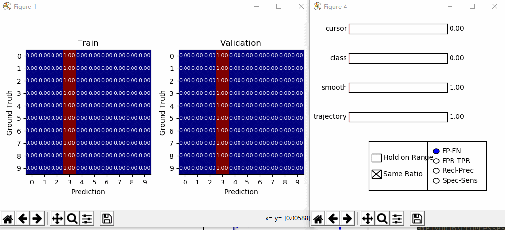
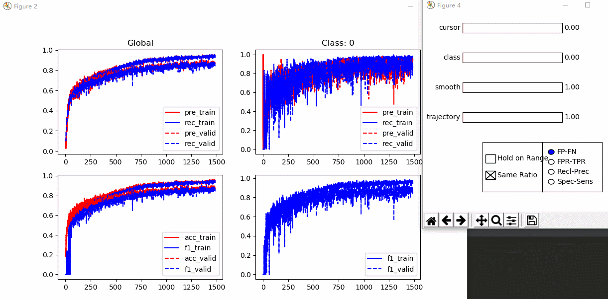
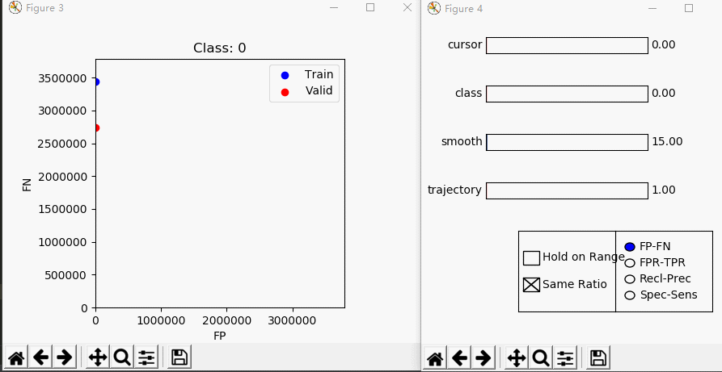

# Confusion_Visualization

This tool provides an intuitive visualization of confusion matrix (series). Given two CxCxT confusion data (C for class amount, T for epochs, training and validation respectively), it gives some visualization as stated in the following. I hope this can be helpful for model diagnosis.


## Function

**1. Heatmaps for confusion matrix at epoch t**




**2. Global and class-specific performances regard to epoch, including accuracy, precision, recall, f1**




**3. A scatter for FP-FN etc., to understand the trend of mistakes.**




## How to start

You can follow a simple example in example.py, namely following:

```
train_confusion_path = './confusion_example/confusions_train.pkl'
valid_confusion_path = './confusion_example/confusions_validate.pkl'
from pinglib.interactive.confusion_visualizer import Confusion_Visualizer
conf_visual = Confusion_Visualizer(train_confusion_path, valid_confusion_path,
                                   class_names=['Tumor', 'XX', 'XX', 'XX', 'XX', 'XX', 'XX', 'XX', 'XX', 'XX'])
```

,where you pass two CxCxT tensors (or two pkl file which store CxCxT ndarray, or two directory contain pkl files from 0.pkl to {T-1}.pkl, each stores CxC matrix), and the name of classes(optional).

C[i,j] = cij means cij **samples** of class i, is classified as class j. That is to say, the row id is ground-truth, col id is prediction. (In heatmap, it is normalized by row summation)


## Dependency

This tool is based on matplotlib. Tested under Windows.
